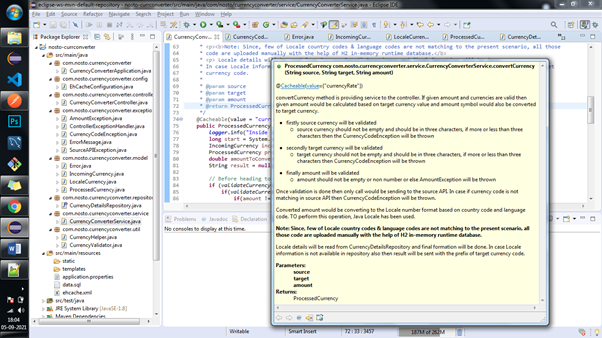
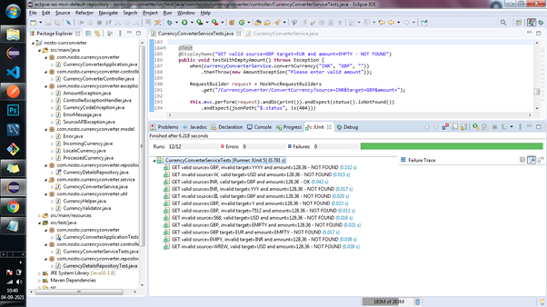
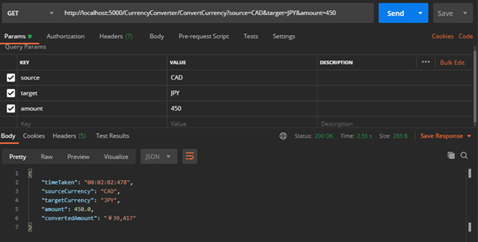
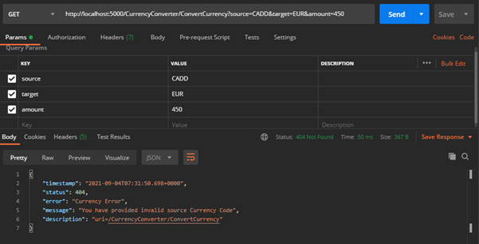
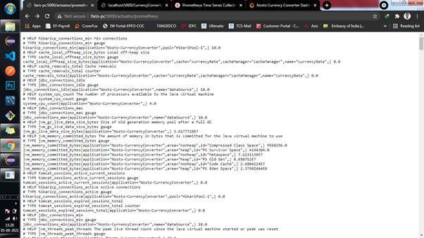
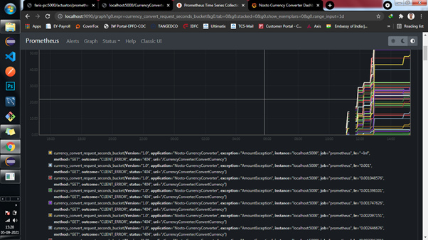
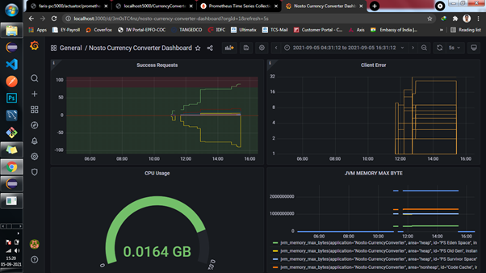

# nosto-currconverter
Currency Converter

This project is developed using Java 8, Reast API, Springboot, JPA, H2 Database, Prometheus and Grafana.
This is a API allication that convert source currency to target currency for given amount, 
then will return converted value in Locale number format(Ex: ￥ 39,417).

To run this spring boot project in your eclipse, kindly clone this repository to your local,
open project in any IDE and run this com.nosto.currencyconverter.CurrencyConverterApplication
java class as Java application. Finally trigger below endpoint using any browser or postman.

Enpoint: http://localhost:5000/CurrencyConverter/ConvertCurrency?source=CAD&target=JPY&amount=128.36

Values and symbols are consumed from source API http://api.exchangeratesapi.io

### Service class from eclipse.

### JUnit test case results from eclipse.

### Success response from Postman.

### Source currency failure response from Postman.

### Target currency failure response from Postman.

### Prometheus Actuator response from browser.
Used Prometheus to collect metrics for currency converter API. This will feed data to Grafana to create a dashboard.
Also we can monitor our application by creating alerts.

### Prometheus Graph view response from browser.
Used Prometheus to collect metrics for currency converter API. This will feed data to Grafana to create a dashboard.
Also we can monitor our application by creating alerts.

### Grafana dashboard view.
Used Prometheus as dataset and created highlevel dashboard for monitoring purpose in Grafana.

